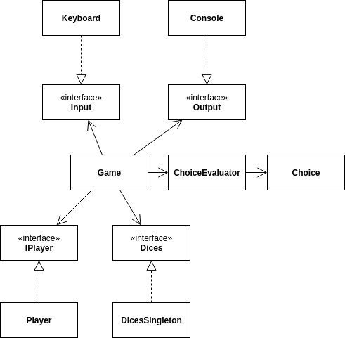

# Dice game
### About the project
[Dice 10000](https://en.wikipedia.org/wiki/Dice_10000) game (with custom scoring system) build in Java 8 for practicing writing [clean code](https://www.amazon.com/Clean-Code-Handbook-Software-Craftsmanship-ebook/dp/B001GSTOAM) and [clean architecture](https://www.amazon.com/Clean-Architecture-Craftsmans-Software-Structure/dp/0134494164) with [SOLID](https://en.wikipedia.org/wiki/SOLID) principles. Tests written in JUnit 5.

### Class diagram
\
